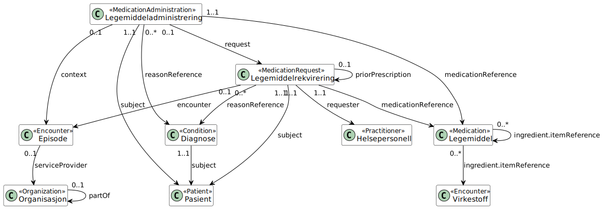

# Legemiddeldata fra institusjon til Legemiddelregisteret (LMDI)

Komplette og oppdaterte helsedata på legemidler er tilgjengelig for analyse og forskning med tanke på å forbedre kvalitet, styring, helseovervåking, beredskap og kunnskapsforvaltning i helsetjenesten

## Mål

Samle inn legemiddeldata på individnivå fra polikliniske og innlagte pasienter i institusjon til Legemiddelregisteret (LMR). Som et ledd i dette utvikles det en implementasjonsguide (IG) basert på en felles informasjonsmodell og HL7 FHIR (dette dokumentet). Dette skal benyttes for innsending av data fra institusjon til LMR ved hjelp av datadeling (sikret REST API).

## Spesifikasjon

### Overordnet informasjonsmodell

## Utvikling

- All koding av profiler skjer med [FHIR Shorthand](https://www.hl7.org/fhir/uv/shorthand/) (FSH)
- Dokumentasjon genereres med [IG Publisher](https://confluence.hl7.org/display/FHIR/IG+Publisher+Documentation)

I første omgang utvikles implementasjonsguiden for [FHIR R4](https://www.hl7.org/fhir/R4/), da dette er anbefalingen fra Helsedirektoratet og HL7 Norge. Tilrettelegging for R4B eller R5 må vurderes på et senere tidspunkt. 

Er HL7 FHIR nytt for deg anbefaler vi å ta en titt på [HL7 Norge sin side med ressurser](https://hl7norway.github.io/best-practice/docs/resources.html), f.eks. introduksjon for henholdsvis [klinikere](https://www.hl7.org/fhir/overview-clinical.html), [arkitekter](https://www.hl7.org/fhir/overview-arch.html) og [utviklere](https://www.hl7.org/fhir/overview-dev.html).

## Implementasjonsguide og dokumentasjon

Implementasjonsguiden for LMDI er tilgjengelig på [folkehelseinstituttet.github.io/LMDI](https://folkehelseinstituttet.github.io/LMDI/) og oppdateres løpende i takt med utviklingen av profilene. Her finner du en helhetlig oversikt over informasjonsmodellen, eksempelkode og anbefalinger for hvordan løsninger kan integreres mot LMDI ved bruk av HL7 FHIR.

Implementasjonsguiden inneholder detaljert dokumentasjon for alle FHIR-profilene som inngår i implementasjonen, inkludert beskrivelser av obligatoriske og valgfrie elementer, eksempelscenarier og referanser til gjeldende kodeverk. I tillegg kan du laste ned profiler, eksempelfiler og andre relevante artefakter som JSON- eller XML-pakker for bruk i egne utviklings- og testmiljøer.

## Plan

Implementasjonsguiden i 1.0.x-serien er publisert og oppdateres fortløpende med forbedringer basert på tilbakemeldinger fra
pilotering og innføring hos institusjonene.

## Status og historikk

| Versjon | Dato | Kort beskrivelse |
|---------|------|------------------|
| 1.0.7 | 2025-09-30 | Oppdateringer av adresser og extensions i Pasient og Organisasjon |
| 1.0.6 | 2025-09-12 | Helsepersonell, Organisasjon, Pasient og Virkestoff basert på no-basis |
| 1.0.5 | 2025-07-28 | Støtte for både string og UUID i NPR-episoder; nye kodeslicer for Legemiddel |
| 1.0.4 | 2025-05-30 | SNOMED CT-støtte for Legemiddel og ny Virkestoff-profil |
| 1.0.3 | 2025-04-11 | Justeringer i Legemiddelrekvirering og nye extensions |
| 1.0.2 | 2025-04-01 | Nye extensions for Legemiddelrekvirering |
| 1.0.1 | 2025-02-04 | Endret LegemiddelregisterBundle til Transaction |
| 1.0.0 | 2025-01-15 | Første offisielle versjon |

## Lisens

Innholdet i dette repositoriet er lisensiert under [Creative Commons Attribution 4.0 International](https://creativecommons.org/licenses/by/4.0/) (CC BY 4.0). Se `LICENSE` for full lisensinformasjon.

## Kontakt

Har du spørsmål om implementasjonsguiden eller innsending av data til Legemiddelregisteret, ta kontakt med Legemiddelregisteret på [legemiddelregisteret@fhi.no](mailto:legemiddelregisteret@fhi.no).

 
