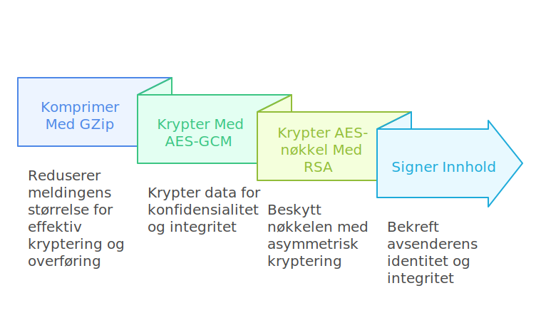

# SignertKryptertBundle - Legemiddeldata fra institusjon til Legemiddelregisteret v1.1.0

*  [Hjem](index.md) 
*  [Informasjonsmodell](informasjonsmodell.md) 
*  [Integrasjon](integrasjon.md) 
*  [FHIR-profiler](profiler.md) 
*  [Nedlastinger](nedlastinger.md) 

* [Home](en-index.md)
* [Information Model](en-informasjonsmodell.md)
* [Integration](en-integrasjon.md) 
* [Protocol](en-protokoll.md)
* [SignedEncryptedBundle](en-SignertKryptertBundle.md)
* [C# Example Code](en-eksempelkode_cs.md)
* [PowerShell Example Code](en-eksempelkode_ps1.md)
 
* [FHIR Profiles](en-profiler.md)
* [Downloads](en-nedlastinger.md)

* [**Table of Contents**](toc.md)
* [**Integrasjon**](integrasjon.md)
* **SignertKryptertBundle**

Når data skal leveres fra institusjoner til Legemiddelregisteret skal dette sendes i en `SignertKryptertBundle`. Denne lages ved å komprimere `LegemiddelregisteretBundle`, kryptere og signere innholdet.

Her beskrives hvordan du må gå frem for å lage en `SignertKryptertBundle` som skal sendes til Legemiddelregisterets API. Implementasjonsdetaljer (språk, biblioteker osv.) står du fritt til å velge, så lenge resultatet samsvarer med spesifikasjonen under.

Eksempel-kode for å generere en SignertKryptertBundle: [Eksempel i C#](eksempelkode_cs.md)

 

### 1. Opprett FHIR-ressurs

Først lages en JSON-representasjon av FHIR-ressursen `LegemiddelregisterBundle`.

Bruk standardbiblioteker eller tredjepartsbiblioteker for FHIR hvis ønskelig. Viktig at JSON-strukturen er korrekt for FHIR-standarden slik at validering i Legemiddelregisterets API ikke feiler. Valider gjerne FHIR-ressursen lokalt før kryptering for å unngå at meldinger feiler i serveren.

### 2. Komprimer med GZip

For å redusere båndbredde og sikre at krypteringsprosessen er effektiv, må dataene GZip-komprimeres
 Resultatet blir en byte-array av komprimerte data. GZip benytter DEFLATE-algoritmen og er en standardisert og velprøvd metode.

I Java kan man typisk bruke klasser fra java.util.zip. I .NET finnes tilsvarende funksjonalitet i System.IO.Compression.

Resultatet etter GZip-komprimering skal være en byte-array som inneholder den komprimerte FHIR-JSONen.

### 3. Krypter med AES-GCM (256-bits nøkkel)

1. **Generer AES-nøkkel og nonce**
* Nøkkelen skal være 256 bits (32 bytes).
* `nonce` (initialiseringsvektor) skal være 96 bits (12 bytes). Denne skal genereres tilfeldig hver gang en kryptering utføres.

1. **Krypter med AES-GCM**
* Krypter den komprimerte byte-arrayen med AES-GCM. I Java er dette tilgjengelig via AES/GCM/NoPadding, mens i .NET er det tilgjengelig via f.eks. AesGcm (fra .NET 5/6 og nyere).
* Merk at AES-GCM vil generere en autentiseringstag (typisk 128 bits = 16 bytes).
* Ut fra krypteringen får du: 
* `encryptedContent` (selve cipher-teksten)
* `authenticationTag` (brukes til å validere at innholdet ikke er endret)
 
* AES-256-GCM gir både konfidensialitet (kryptering) og integritet (autentiseringstag) uten behov for en separat HMAC.

### 4. Krypter AES-nøkkelen med RSA (Legemiddelregisterets offentlige nøkkel)

Den 256-bits AES-nøkkelen fra steg 3 krypteres med Legemiddelregisterets offentlige RSA-nøkkel. Dette er tilgjengelig i sertifikatene som kan lastes ned [her](nedlastinger.md)

Algoritmen skal være RSA OAEP med SHA-256 (RSAEncryptionPadding.OaepSHA256). Resultatet er et byte-array `encryptedKey`.

Legemiddelregisterets offentlige RSA-nøkkel hentes fra Legemiddelregisterets virksomhetssertifikat. Thumbprintet til sertifikatet som benyttes skal angis som `encryptionCertificateThumbprint` i `SignertKryptertBundle`.

### 5. Signer kryptert innhold (avsenders private nøkkel)

For at Legemiddelregisteret skal være sikre at innholdet faktisk kommer fra rett organisasjon (integritets- og autentisitetskontroll), må meldingen signeres:

1. Finn avsenders private nøkkel
* Avsender bruker sitt sertifikat (med tilhørende privat nøkkel) til signering.
* Avsenders sertifikat har også en unik thumbprint, som skal oppgis i meldingen som `signatureCertificateThumbprint`.

1. Opprett hash av det krypterte innholdet
* Bruk SHA-256 for å lage en hash av `encryptedContent`.

1. Signer hashen (RSA-PKCS1-v1.5)
* Bruk privat nøkkel til avsenders sertifikat for signaturen.
* Resultatet lagres som en byte-array i `signature`.

1. Oppgi avsenders organisasjonsidentifikator
* Dette er en OID eller annen identifikator som knyttes til avsenders sertifikat.
* Serveren vår vil verifisere at avsenders sertifikat (gitt ved `signatureCertificateThumbprint`) faktisk har denne organisasjonsidentifikatoren.

### 6. Opprett og fyll ut SignertKryptertBundle-objektet

Alle felter skal samles i et JSON-objekt med nøyaktig rekkefølge som nedenfor. Anta at binære data konverteres til Base64-strenger.

| | | |
| :--- | :--- | :--- |
| **messageId** | string | Unik identifikator for meldingen. Gjerne en UUID |
| **senderOrganizationIdentifier** | string | Avsenders organisasjons-ID eller OID (vanligvis organisasjonsnummer) som skal samsvare med sertifikat brukt for signering. |
| **messageFormatVersion** | string | Gjeldende meldingsformat-versjon:`"1.0"`. |
| **rapporteringFra** | string | Angir starttidspunkt for tidsperioden som dataene er hentet fra. Tidspunktet skal være i norsk lokaltid formattert etter ISO 8601, for eksempel:`2025-01-22T10:30:00Z` |
| **rapporteringTil** | string | Angir sluttidspunkt for tidsperioden som dataene er hentet fra. Tidspunktet skal være i norsk lokaltid formattert etter ISO 8601 |
| **encryptedContent** | string | AES-GCM-kryptert innhold (FHIR-ressursen komprimert og kryptert). Angis som Base64-encodet string. |
| **encryptionCertificateThumbprint** | string | Thumbprint for sertifikatet som ble brukt til kryptering. |
| **encryptedKey** | string | AES-nøkkelen kryptert med Legemiddelregisterets offentlige RSA-nøkkel. Angis som Base64-encodet string. |
| **nonce** | string | 96-bits nonce (12 bytes) brukt ved AES-GCM-krypteringen. Angis som Base64-encodet string. |
| **authenticationTag** | string | 128-bits (16 bytes) autentiseringstag fra AES-GCM. Angis som Base64-encodet string. |
| **signatureCertificateThumbprint** | string | Thumbprint for avsenders sertifikat (med tilhørende privat nøkkel som ble brukt for signering). |
| **signature** | string | Signatur (RSA-PKCS1-v1.5 over SHA-256 hash) av kryptert innhold. Angis som Base64-encodet string. |
| **generatedAt** | string | Tidspunkt (norsk lokaltid) når meldingen ble generert. |

